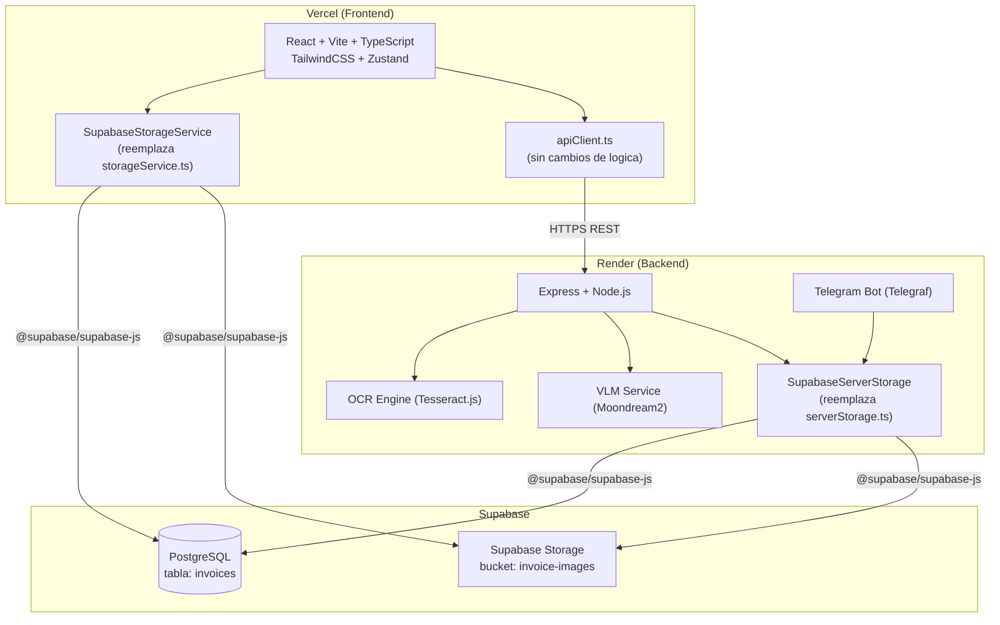

# Documento de Diseno Tecnico: cloud-migration

## Resumen

Este documento describe el diseno tecnico para migrar `invoice-expense-manager` desde almacenamiento local (IndexedDB + archivos JSON en disco) a una arquitectura 100% en la nube usando Supabase, Render y Vercel, todos en tier gratuito.

**Alcance:** Se reemplazan exclusivamente las capas de persistencia (`storageService.ts` y `serverStorage.ts`) y la configuracion de despliegue. Los componentes React, el parser OCR, el exportService, el VLM Service y el bot de Telegram conservan su logica sin cambios.

---

## Arquitectura General



### Flujo de datos principal

1. **Frontend → Supabase directo:** El `SupabaseStorageService` usa el SDK de Supabase para leer/escribir facturas en PostgreSQL y subir imagenes a Storage, sin pasar por el backend.
2. **Frontend → Backend → Supabase:** Para OCR y extraccion de datos, el frontend llama al backend en Render via `apiClient.ts`. El backend procesa la imagen y guarda el resultado en Supabase via `SupabaseServerStorage`.
3. **Telegram → Backend → Supabase:** El bot de Telegram envia comprobantes al backend, que los procesa y persiste en Supabase.

---

## Componentes e Interfaces

### SupabaseStorageService (frontend)

Reemplaza `frontend/src/services/storageService.ts`. Mantiene exactamente la misma interfaz publica para que `invoiceStore.ts` no requiera modificaciones.

```typescript
// frontend/src/services/storageService.ts (reemplazado)
import { createClient, SupabaseClient } from '@supabase/supabase-js';
import type { Invoice } from '../types/invoice';
import { SAMPLE_INVOICES } from '../data/sampleData';

export class StorageError extends Error {
  constructor(message: string, public readonly operation: string) {
    super(message);
    this.name = 'StorageError';
  }
}

const supabaseUrl = import.meta.env.VITE_SUPABASE_URL as string;
const supabaseKey = import.meta.env.VITE_SUPABASE_ANON_KEY as string;

const supabase: SupabaseClient = createClient(supabaseUrl, supabaseKey);

const BUCKET = 'invoice-images';
const TABLE  = 'invoices';

// --- Mapeo camelCase <-> snake_case ---

type InvoiceRow = {
  id: string;
  provider_name: string;
  provider_rut: string;
  document_type: string;
  document_number: string;
  date: string;
  time: string | null;
  category: string;
  items: unknown;
  net_amount: number;
  iva_amount: number;
  exempt_amount: number;
  other_taxes: number;
  total_amount: number;
  payment_method: string;
  image_url: string | null;
  raw_ocr_text: string | null;
  status: string;
  notes: string | null;
  created_at: string;
  updated_at: string;
};

function toRow(inv: Omit<Invoice, 'id' | 'createdAt' | 'updatedAt'> & { id?: string; createdAt?: string; updatedAt?: string }): Partial<InvoiceRow> {
  return {
    ...(inv.id        && { id: inv.id }),
    provider_name:   inv.providerName,
    provider_rut:    inv.providerRut,
    document_type:   inv.documentType,
    document_number: inv.documentNumber,
    date:            inv.date,
    time:            inv.time ?? null,
    category:        inv.category,
    items:           inv.items,
    net_amount:      inv.netAmount,
    iva_amount:      inv.ivaAmount,
    exempt_amount:   inv.exemptAmount,
    other_taxes:     inv.otherTaxes,
    total_amount:    inv.totalAmount,
    payment_method:  inv.paymentMethod,
    image_url:       inv.imageUrl ?? null,
    raw_ocr_text:    inv.rawOcrText ?? null,
    status:          inv.status,
    notes:           inv.notes ?? null,
    ...(inv.createdAt && { created_at: inv.createdAt }),
    ...(inv.updatedAt && { updated_at: inv.updatedAt }),
  };
}

function fromRow(row: InvoiceRow): Invoice {
  return {
    id:             row.id,
    providerName:   row.provider_name,
    providerRut:    row.provider_rut,
    documentType:   row.document_type as Invoice['documentType'],
    documentNumber: row.document_number,
    date:           row.date,
    time:           row.time ?? undefined,
    category:       row.category as Invoice['category'],
    items:          row.items as Invoice['items'],
    netAmount:      row.net_amount,
    ivaAmount:      row.iva_amount,
    exemptAmount:   row.exempt_amount,
    otherTaxes:     row.other_taxes,
    totalAmount:    row.total_amount,
    paymentMethod:  row.payment_method as Invoice['paymentMethod'],
    imageUrl:       row.image_url ?? undefined,
    rawOcrText:     row.raw_ocr_text ?? undefined,
    status:         row.status as Invoice['status'],
    notes:          row.notes ?? undefined,
    createdAt:      row.created_at,
    updatedAt:      row.updated_at,
  };
}

// --- Helpers de imagen ---

async function uploadImage(id: string, file: File | Blob): Promise<string | null> {
  const path = `${id}.jpg`;
  const { error } = await supabase.storage.from(BUCKET).upload(path, file, {
    upsert: true,
    contentType: 'image/jpeg',
  });
  if (error) return null;
  const { data } = supabase.storage.from(BUCKET).getPublicUrl(path);
  return data.publicUrl;
}

async function uploadImageBuffer(id: string, buffer: Buffer): Promise<string | null> {
  const blob = new Blob([buffer], { type: 'image/jpeg' });
  return uploadImage(id, blob);
}

async function deleteImage(id: string): Promise<void> {
  await supabase.storage.from(BUCKET).remove([`${id}.jpg`]);
}

// --- Operaciones CRUD ---

async function initialize(): Promise<void> {
  try {
    const { data, error } = await supabase.from(TABLE).select('id').limit(1);
    if (error) throw error;
    if (data && data.length === 0) {
      const rows = SAMPLE_INVOICES.map((inv) => toRow(inv));
      const { error: insertError } = await supabase.from(TABLE).insert(rows);
      if (insertError) throw insertError;
    }
  } catch (err) {
    throw new StorageError(
      `Failed to initialize: ${err instanceof Error ? err.message : String(err)}`,
      'initialize'
    );
  }
}

async function saveInvoice(
  data: Omit<Invoice, 'id' | 'createdAt' | 'updatedAt'>
): Promise<Invoice> {
  try {
    const now = new Date().toISOString();
    const { data: inserted, error } = await supabase
      .from(TABLE)
      .insert({ ...toRow(data), created_at: now, updated_at: now })
      .select()
      .single();
    if (error) throw error;
    return fromRow(inserted as InvoiceRow);
  } catch (err) {
    throw new StorageError(
      `Failed to save invoice: ${err instanceof Error ? err.message : String(err)}`,
      'saveInvoice'
    );
  }
}

async function importInvoice(invoice: Invoice): Promise<void> {
  try {
    const { error } = await supabase
      .from(TABLE)
      .upsert(toRow(invoice), { onConflict: 'id' });
    if (error) throw error;
  } catch (err) {
    throw new StorageError(
      `Failed to import invoice: ${err instanceof Error ? err.message : String(err)}`,
      'importInvoice'
    );
  }
}

async function updateInvoice(id: string, updates: Partial<Invoice>): Promise<Invoice> {
  try {
    const { data, error } = await supabase
      .from(TABLE)
      .update({ ...toRow(updates as Invoice), updated_at: new Date().toISOString() })
      .eq('id', id)
      .select()
      .single();
    if (error) throw error;
    if (!data) throw new Error(`Invoice with id "${id}" not found`);
    return fromRow(data as InvoiceRow);
  } catch (err) {
    throw new StorageError(
      `Failed to update invoice: ${err instanceof Error ? err.message : String(err)}`,
      'updateInvoice'
    );
  }
}

async function deleteInvoice(id: string): Promise<void> {
  try {
    await deleteImage(id);
    const { error } = await supabase.from(TABLE).delete().eq('id', id);
    if (error) throw error;
  } catch (err) {
    throw new StorageError(
      `Failed to delete invoice: ${err instanceof Error ? err.message : String(err)}`,
      'deleteInvoice'
    );
  }
}

async function getAllInvoices(): Promise<Invoice[]> {
  try {
    const { data, error } = await supabase
      .from(TABLE)
      .select('*')
      .order('date', { ascending: false });
    if (error) throw error;
    return (data as InvoiceRow[]).map(fromRow);
  } catch (err) {
    throw new StorageError(
      `Failed to get all invoices: ${err instanceof Error ? err.message : String(err)}`,
      'getAllInvoices'
    );
  }
}

async function getInvoiceById(id: string): Promise<Invoice | null> {
  try {
    const { data, error } = await supabase
      .from(TABLE)
      .select('*')
      .eq('id', id)
      .maybeSingle();
    if (error) throw error;
    return data ? fromRow(data as InvoiceRow) : null;
  } catch (err) {
    throw new StorageError(
      `Failed to get invoice by id: ${err instanceof Error ? err.message : String(err)}`,
      'getInvoiceById'
    );
  }
}

async function clearAllInvoices(): Promise<void> {
  try {
    const { error } = await supabase.from(TABLE).delete().neq('id', '');
    if (error) throw error;
  } catch (err) {
    throw new StorageError(
      `Failed to clear all invoices: ${err instanceof Error ? err.message : String(err)}`,
      'clearAllInvoices'
    );
  }
}

export const storageService = {
  initialize,
  saveInvoice,
  importInvoice,
  updateInvoice,
  deleteInvoice,
  getAllInvoices,
  getInvoiceById,
  clearAllInvoices,
};

// Exportar helpers de imagen para uso en migracion de datos
export { uploadImage, uploadImageBuffer, deleteImage };
```

### SupabaseServerStorage (backend)

Reemplaza `backend/src/services/serverStorage.ts`. Mantiene exactamente la misma interfaz publica para que `telegramBot.ts` y las rutas no requieran modificaciones.

```typescript
// backend/src/services/serverStorage.ts (reemplazado)
import { createClient, SupabaseClient } from '@supabase/supabase-js';
import { v4 as uuidv4 } from 'uuid';
import type { Invoice } from '../types/invoice';

const supabaseUrl = process.env.SUPABASE_URL!;
const supabaseKey = process.env.SUPABASE_ANON_KEY!;

const supabase: SupabaseClient = createClient(supabaseUrl, supabaseKey);

const BUCKET = 'invoice-images';
const TABLE  = 'invoices';

// Reutiliza las mismas funciones toRow/fromRow del frontend (duplicadas aqui para independencia)
// [misma implementacion que en el frontend — ver seccion anterior]

async function uploadImageBuffer(id: string, buffer: Buffer): Promise<string | null> {
  const { error } = await supabase.storage
    .from(BUCKET)
    .upload(`${id}.jpg`, buffer, { upsert: true, contentType: 'image/jpeg' });
  if (error) return null;
  const { data } = supabase.storage.from(BUCKET).getPublicUrl(`${id}.jpg`);
  return data.publicUrl;
}

export const serverStorage = {
  async getAllInvoices(): Promise<Invoice[]> {
    const { data, error } = await supabase
      .from(TABLE)
      .select('*')
      .order('date', { ascending: false });
    if (error) throw new Error(`getAllInvoices failed: ${error.message}`);
    return (data as InvoiceRow[]).map(fromRow);
  },

  async getInvoiceById(id: string): Promise<Invoice | null> {
    const { data, error } = await supabase
      .from(TABLE)
      .select('*')
      .eq('id', id)
      .maybeSingle();
    if (error) throw new Error(`getInvoiceById failed: ${error.message}`);
    return data ? fromRow(data as InvoiceRow) : null;
  },

  async saveInvoice(
    data: Omit<Invoice, 'id' | 'createdAt' | 'updatedAt'>,
    imageBuffer?: Buffer
  ): Promise<Invoice> {
    const now = new Date().toISOString();
    const id = uuidv4();

    let imageUrl = data.imageUrl ?? null;
    if (imageBuffer && imageBuffer.length > 0) {
      const url = await uploadImageBuffer(id, imageBuffer);
      if (url) imageUrl = url;
    }

    const row = { ...toRow({ ...data, imageUrl: imageUrl ?? undefined }), id, created_at: now, updated_at: now };
    const { data: inserted, error } = await supabase
      .from(TABLE)
      .insert(row)
      .select()
      .single();
    if (error) throw new Error(`saveInvoice failed: ${error.message}`);
    return fromRow(inserted as InvoiceRow);
  },

  async updateInvoice(id: string, updates: Partial<Invoice>): Promise<Invoice | null> {
    const { data, error } = await supabase
      .from(TABLE)
      .update({ ...toRow(updates as Invoice), updated_at: new Date().toISOString() })
      .eq('id', id)
      .select()
      .single();
    if (error) return null;
    return fromRow(data as InvoiceRow);
  },

  async deleteInvoice(id: string): Promise<boolean> {
    await supabase.storage.from(BUCKET).remove([`${id}.jpg`]);
    const { error } = await supabase.from(TABLE).delete().eq('id', id);
    return !error;
  },

  // Mantenido por compatibilidad — ya no sirve archivos estaticos
  getImagesDir(): string {
    return '';
  },
};
```

---

## Modelos de Datos

### Esquema SQL para Supabase

```sql
-- Crear tabla invoices
CREATE TABLE IF NOT EXISTS public.invoices (
  id               UUID PRIMARY KEY DEFAULT gen_random_uuid(),
  provider_name    TEXT NOT NULL,
  provider_rut     TEXT NOT NULL DEFAULT '',
  document_type    TEXT NOT NULL CHECK (document_type IN ('boleta','factura','boleta_electronica','factura_electronica','otro')),
  document_number  TEXT NOT NULL DEFAULT '',
  date             DATE NOT NULL,
  time             TEXT,
  category         TEXT NOT NULL,
  items            JSONB NOT NULL DEFAULT '[]'::jsonb,
  net_amount       NUMERIC(12,2) NOT NULL DEFAULT 0,
  iva_amount       NUMERIC(12,2) NOT NULL DEFAULT 0,
  exempt_amount    NUMERIC(12,2) NOT NULL DEFAULT 0,
  other_taxes      NUMERIC(12,2) NOT NULL DEFAULT 0,
  total_amount     NUMERIC(12,2) NOT NULL DEFAULT 0,
  payment_method   TEXT NOT NULL CHECK (payment_method IN ('efectivo','debito','credito','transferencia','otro')),
  image_url        TEXT,
  raw_ocr_text     TEXT,
  status           TEXT NOT NULL DEFAULT 'pending' CHECK (status IN ('pending','reviewed','approved')),
  notes            TEXT,
  created_at       TIMESTAMPTZ NOT NULL DEFAULT now(),
  updated_at       TIMESTAMPTZ NOT NULL DEFAULT now()
);

-- Indice para ordenamiento y filtrado por fecha
CREATE INDEX IF NOT EXISTS idx_invoices_date ON public.invoices (date DESC);

-- Indice para filtrado por categoria
CREATE INDEX IF NOT EXISTS idx_invoices_category ON public.invoices (category);

-- Deshabilitar RLS (la app no implementa autenticacion de usuarios en esta version)
ALTER TABLE public.invoices DISABLE ROW LEVEL SECURITY;
```

### Configuracion de Supabase Storage

```sql
-- Crear bucket publico para imagenes de comprobantes
INSERT INTO storage.buckets (id, name, public)
VALUES ('invoice-images', 'invoice-images', true)
ON CONFLICT (id) DO NOTHING;
```

### Mapeo camelCase (TypeScript) <-> snake_case (PostgreSQL)

| TypeScript (Invoice)  | PostgreSQL (invoices)  | Tipo SQL          |
|-----------------------|------------------------|-------------------|
| `id`                  | `id`                   | UUID              |
| `providerName`        | `provider_name`        | TEXT              |
| `providerRut`         | `provider_rut`         | TEXT              |
| `documentType`        | `document_type`        | TEXT (enum check) |
| `documentNumber`      | `document_number`      | TEXT              |
| `date`                | `date`                 | DATE              |
| `time`                | `time`                 | TEXT (nullable)   |
| `category`            | `category`             | TEXT              |
| `items`               | `items`                | JSONB             |
| `netAmount`           | `net_amount`           | NUMERIC(12,2)     |
| `ivaAmount`           | `iva_amount`           | NUMERIC(12,2)     |
| `exemptAmount`        | `exempt_amount`        | NUMERIC(12,2)     |
| `otherTaxes`          | `other_taxes`          | NUMERIC(12,2)     |
| `totalAmount`         | `total_amount`         | NUMERIC(12,2)     |
| `paymentMethod`       | `payment_method`       | TEXT (enum check) |
| `imageUrl`            | `image_url`            | TEXT (nullable)   |
| `rawOcrText`          | `raw_ocr_text`         | TEXT (nullable)   |
| `status`              | `status`               | TEXT (enum check) |
| `notes`               | `notes`                | TEXT (nullable)   |
| `createdAt`           | `created_at`           | TIMESTAMPTZ       |
| `updatedAt`           | `updated_at`           | TIMESTAMPTZ       |

---

## Cambios en Archivos Existentes

### backend/src/config.ts

```typescript
import dotenv from 'dotenv';

dotenv.config();

// Validacion de variables requeridas al inicio
const REQUIRED_VARS = ['SUPABASE_URL', 'SUPABASE_ANON_KEY'] as const;
for (const varName of REQUIRED_VARS) {
  if (!process.env[varName]) {
    console.error(`[Config] ERROR CRITICO: La variable de entorno "${varName}" no esta definida.`);
    process.exit(1);
  }
}

export const config = {
  supabase: {
    url:     process.env.SUPABASE_URL!,
    anonKey: process.env.SUPABASE_ANON_KEY!,
  },
  vlm: {
    mode:      (process.env.VLM_MODE as 'local' | 'remote') || 'local',
    localUrl:  process.env.VLM_LOCAL_URL || 'http://localhost:11434',
    localModel: process.env.VLM_LOCAL_MODEL || 'llava',
    remoteUrl: process.env.VLM_REMOTE_URL || '',
    timeoutMs: parseInt(process.env.VLM_TIMEOUT_MS || '120000', 10),
  },
  telegram: {
    botToken:       process.env.TELEGRAM_BOT_TOKEN || '',
    webhookUrl:     process.env.TELEGRAM_WEBHOOK_URL || '',
    allowedUserIds: (process.env.TELEGRAM_ALLOWED_USER_IDS || '')
      .split(',')
      .filter(Boolean)
      .map(Number),
  },
  server: {
    port:    parseInt(process.env.PORT || '3001', 10),
    nodeEnv: process.env.NODE_ENV || 'development',
    corsOrigins: (process.env.CORS_ORIGINS || 'http://localhost:5173')
      .split(',')
      .map((s) => s.trim())
      .filter(Boolean),
  },
};
```

### backend/src/app.ts

```typescript
import 'dotenv/config';
import express from 'express';
import cors from 'cors';
import { invoiceRoutes }  from './routes/invoiceRoutes';
import { vlmRoutes }      from './routes/vlmRoutes';
import { telegramRoutes } from './routes/telegramRoutes';
import { storageRoutes }  from './routes/storageRoutes';
import { errorHandler }   from './middleware/errorHandler';
import { config }         from './config';
import { bot }            from './services/telegramBot';

const app = express();

// CORS configurable via variable de entorno CORS_ORIGINS
app.use(cors({
  origin: config.server.corsOrigins,
  methods: ['GET', 'POST', 'PUT', 'PATCH', 'DELETE', 'OPTIONS'],
  allowedHeaders: ['Content-Type', 'Authorization'],
}));

app.use(express.json({ limit: '50mb' }));

// Health check para Render
app.get('/health', (_req, res) => {
  res.status(200).json({ status: 'ok' });
});

app.use('/api/invoices',  invoiceRoutes);
app.use('/api/vlm',       vlmRoutes);
app.use('/api/telegram',  telegramRoutes);
app.use('/api/storage',   storageRoutes);

app.use(errorHandler);

export { app };

export function startServer(): void {
  app.listen(config.server.port, () => {
    console.log(`[Server] Running on port ${config.server.port} (${config.server.nodeEnv})`);
    console.log(`[Server] CORS origins: ${config.server.corsOrigins.join(', ')}`);
    console.log(`[Supabase] URL: ${config.supabase.url}`);
  });

  if (!config.telegram.botToken) {
    console.log('[Telegram] No token configured, bot disabled.');
    return;
  }

  if (config.telegram.webhookUrl) {
    bot.telegram.setWebhook(config.telegram.webhookUrl).then(() => {
      console.log(`[Telegram] Webhook set: ${config.telegram.webhookUrl}`);
    });
  } else {
    bot.launch({ dropPendingUpdates: true }).then(() => {
      console.log('[Telegram] Bot started in polling mode.');
    }).catch((err) => {
      console.error('[Telegram] Failed to start bot:', err);
    });
    process.once('SIGINT',  () => bot.stop('SIGINT'));
    process.once('SIGTERM', () => bot.stop('SIGTERM'));
  }
}

if (require.main === module) {
  startServer();
}
```

### frontend/src/services/apiClient.ts

El `apiClient.ts` no requiere cambios de logica. La URL base ya se lee desde `VITE_API_BASE_URL` con fallback a `localhost:3001`. Solo se actualiza el mensaje de error de conectividad para mencionar el cold start de Render:

```typescript
// Cambio minimo: actualizar el mensaje de error de red
} else if (axiosError.request) {
  throw new ApiError(
    'No se pudo conectar con el servidor. Verifica tu conexion a internet. Si el servidor acaba de iniciar, puede tardar hasta 60 segundos (cold start).',
    undefined,
    error
  );
}
```

---

## Archivos de Configuracion de Despliegue

### render.yaml

```yaml
# render.yaml — en la raiz del repositorio
services:
  - type: web
    name: invoice-expense-manager-api
    env: node
    rootDir: backend
    buildCommand: npm install && npm run build
    startCommand: npm start
    healthCheckPath: /health
    envVars:
      - key: NODE_ENV
        value: production
      - key: SUPABASE_URL
        sync: false
      - key: SUPABASE_ANON_KEY
        sync: false
      - key: TELEGRAM_BOT_TOKEN
        sync: false
      - key: TELEGRAM_WEBHOOK_URL
        sync: false
      - key: TELEGRAM_ALLOWED_USER_IDS
        sync: false
      - key: CORS_ORIGINS
        sync: false
      - key: VLM_MODE
        value: local
```

### frontend/vercel.json

```json
{
  "framework": "vite",
  "outputDirectory": "dist",
  "rewrites": [
    { "source": "/(.*)", "destination": "/index.html" }
  ],
  "headers": [
    {
      "source": "/(.*)",
      "headers": [
        { "key": "X-Content-Type-Options", "value": "nosniff" },
        { "key": "X-Frame-Options", "value": "DENY" }
      ]
    }
  ]
}
```

### backend/.env.example (actualizado)

```dotenv
# =============================================================================
# Invoice Expense Manager — Backend Environment Variables
# =============================================================================
# Copia este archivo como .env y completa los valores segun tu entorno.
# NUNCA subas el archivo .env al repositorio.

# -----------------------------------------------------------------------------
# Supabase (REQUERIDO)
# -----------------------------------------------------------------------------

# URL del proyecto Supabase (ej. https://xxxx.supabase.co)
SUPABASE_URL=

# Clave publica anonima del proyecto Supabase
SUPABASE_ANON_KEY=

# -----------------------------------------------------------------------------
# CORS
# -----------------------------------------------------------------------------

# Origenes permitidos separados por coma (ej. https://mi-app.vercel.app,http://localhost:5173)
# Default: http://localhost:5173
CORS_ORIGINS=http://localhost:5173

# -----------------------------------------------------------------------------
# VLM Service (Moondream2)
# -----------------------------------------------------------------------------

VLM_MODE=local
VLM_LOCAL_URL=http://localhost:11434
VLM_LOCAL_MODEL=llava
VLM_REMOTE_URL=
VLM_TIMEOUT_MS=120000

# -----------------------------------------------------------------------------
# Telegram Bot
# -----------------------------------------------------------------------------

TELEGRAM_BOT_TOKEN=
TELEGRAM_WEBHOOK_URL=
TELEGRAM_ALLOWED_USER_IDS=

# -----------------------------------------------------------------------------
# Servidor Express
# -----------------------------------------------------------------------------

PORT=3001
NODE_ENV=development
```

### frontend/.env.example (actualizado)

```dotenv
# =============================================================================
# Invoice Expense Manager — Frontend Environment Variables
# =============================================================================
# Copia este archivo como .env.local y completa los valores segun tu entorno.
# NUNCA subas el archivo .env.local al repositorio.

# URL del backend en Render (produccion) o localhost (desarrollo)
# Ejemplo produccion: https://invoice-expense-manager-api.onrender.com
VITE_API_BASE_URL=http://localhost:3001

# URL del proyecto Supabase (ej. https://xxxx.supabase.co)
VITE_SUPABASE_URL=

# Clave publica anonima del proyecto Supabase
VITE_SUPABASE_ANON_KEY=
```


---

## Propiedades de Correccion

*Una propiedad es una caracteristica o comportamiento que debe ser verdadero en todas las ejecuciones validas del sistema — esencialmente, una declaracion formal sobre lo que el sistema debe hacer. Las propiedades sirven como puente entre las especificaciones legibles por humanos y las garantias de correccion verificables por maquina.*

Las propiedades de correccion aplican a las funciones puras de mapeo (toRow/fromRow) y a la logica de las operaciones CRUD del SupabaseStorageService, testeadas con mocks del Supabase_Client usando fast-check.

### Propiedad 1: Round-trip de persistencia

*Para cualquier* Invoice valido, la secuencia saveInvoice(invoice) seguida de getInvoiceById(id) debe retornar un objeto con los mismos valores en todos los campos que el Invoice original.

**Valida: Requerimientos 1.2, 1.4, 1.9, 13.2**

### Propiedad 2: Actualizacion preserva campos y renueva updatedAt

*Para cualquier* Invoice guardado y cualquier conjunto de actualizaciones parciales updates, la secuencia saveInvoice -> updateInvoice(id, updates) -> getInvoiceById(id) debe retornar un Invoice que contenga los valores de updates y cuyo updatedAt sea mayor o igual al updatedAt anterior.

**Valida: Requerimientos 1.5, 13.4**

### Propiedad 3: Eliminacion hace getById retornar null

*Para cualquier* Invoice guardado, la secuencia saveInvoice -> deleteInvoice(id) -> getInvoiceById(id) debe retornar null.

**Valida: Requerimientos 1.6, 13.3**

### Propiedad 4: Errores de Supabase se convierten en StorageError

*Para cualquier* operacion CRUD (saveInvoice, updateInvoice, deleteInvoice, getAllInvoices, getInvoiceById) y cualquier error retornado por el Supabase_Client mock, la operacion debe lanzar un StorageError con el nombre de la operacion fallida en el campo operation.

**Valida: Requerimientos 1.7, 12.3, 13.5**

### Propiedad 5: getAllInvoices retorna ordenado por date descendente

*Para cualquier* lista de Invoices con fechas arbitrarias almacenados en Supabase_DB, getAllInvoices() debe retornar la lista ordenada de forma que para todo par consecutivo (a, b) en el resultado, a.date >= b.date.

**Valida: Requerimientos 1.3, 3.3**

### Propiedad 6: Round-trip de mapeo camelCase <-> snake_case

*Para cualquier* Invoice valido, la composicion fromRow(toRow(invoice)) debe producir un objeto con los mismos valores en todos los campos que el Invoice original (propiedad de identidad del mapeo).

**Valida: Requerimiento 4.2**

### Propiedad 7: Imagen subida genera URL con patron correcto

*Para cualquier* Invoice con imagen, cuando saveInvoice sube la imagen a Supabase_Storage, el campo imageUrl del Invoice retornado debe ser una URL que contenga el id del Invoice y el nombre del bucket invoice-images.

**Valida: Requerimientos 2.1, 2.2, 3.2**

### Propiedad 8: importInvoice es idempotente

*Para cualquier* Invoice valido, llamar a importInvoice(invoice) dos veces consecutivas debe resultar en exactamente un registro en Supabase_DB (sin duplicados), y getInvoiceById(invoice.id) debe retornar el Invoice con los valores de la segunda llamada.

**Valida: Requerimiento 8.3**

---

## Manejo de Errores

### Clasificacion de errores

| Tipo de error                        | Clase lanzada     | Mensaje                                                                 |
|--------------------------------------|-------------------|-------------------------------------------------------------------------|
| Error de red (sin respuesta)         | StorageError      | "No se pudo conectar con Supabase. Verifica tu conexion a internet."    |
| Credenciales invalidas (401)         | StorageError      | "Error de autenticacion con Supabase. Verifica las credenciales."       |
| Registro no encontrado               | StorageError      | "Invoice con id X no encontrado."                                       |
| Violacion de restriccion (409)       | StorageError      | "Conflicto al guardar: el registro ya existe."                          |
| Error de subida de imagen            | Advertencia       | Invoice guardado sin imagen; imageUrl = null                            |
| Variable de entorno faltante         | process.exit(1)   | Log critico + terminacion del proceso                                   |

### Estrategia de error en el frontend

El invoiceStore.ts ya captura errores de storageService y los expone en state.error. Los componentes React muestran este mensaje al usuario. No se requieren cambios en los componentes.

Para errores de conectividad con el backend (cold start de Render), el apiClient.ts ya retorna ApiError con mensaje descriptivo. Se actualiza el mensaje para mencionar el cold start.

---

## Estrategia de Testing

### Enfoque dual

La estrategia combina tests de ejemplo (para casos especificos y errores) con tests basados en propiedades (para verificar comportamiento universal con datos generados aleatoriamente).

### Libreria de PBT

Se usa **fast-check** (ya disponible en el ecosistema TypeScript/Node.js). Configuracion minima de 50 iteraciones por propiedad (segun Requerimiento 13.2), recomendado 100.

### Mock del Supabase_Client

Todos los tests unitarios usan un mock del cliente de Supabase para evitar llamadas reales a la red:

\\\	ypescript
// Ejemplo de mock para tests
import { vi } from 'vitest';

const mockSupabase = {
  from: vi.fn().mockReturnThis(),
  select: vi.fn().mockReturnThis(),
  insert: vi.fn().mockReturnThis(),
  update: vi.fn().mockReturnThis(),
  delete: vi.fn().mockReturnThis(),
  upsert: vi.fn().mockReturnThis(),
  eq: vi.fn().mockReturnThis(),
  neq: vi.fn().mockReturnThis(),
  order: vi.fn().mockReturnThis(),
  limit: vi.fn().mockReturnThis(),
  single: vi.fn(),
  maybeSingle: vi.fn(),
  storage: {
    from: vi.fn().mockReturnThis(),
    upload: vi.fn(),
    remove: vi.fn(),
    getPublicUrl: vi.fn(),
  },
};

vi.mock('@supabase/supabase-js', () => ({
  createClient: vi.fn(() => mockSupabase),
}));
\\\

### Generadores fast-check para Invoice

\\\	ypescript
import * as fc from 'fast-check';

const documentTypeArb = fc.constantFrom(
  'boleta', 'factura', 'boleta_electronica', 'factura_electronica', 'otro'
);
const paymentMethodArb = fc.constantFrom(
  'efectivo', 'debito', 'credito', 'transferencia', 'otro'
);
const statusArb = fc.constantFrom('pending', 'reviewed', 'approved');
const categoryArb = fc.constantFrom(
  'Supermercado', 'Combustible', 'Transporte', 'Servicios basicos',
  'Arriendo', 'Comida', 'Insumos de trabajo', 'Equipamiento',
  'Marketing', 'Internet/Telefonia', 'Otros'
);

const invoiceItemArb = fc.record({
  id:          fc.uuid(),
  description: fc.string({ minLength: 1, maxLength: 100 }),
  quantity:    fc.integer({ min: 1, max: 100 }),
  unitPrice:   fc.float({ min: 0, max: 1_000_000, noNaN: true }),
  total:       fc.float({ min: 0, max: 100_000_000, noNaN: true }),
});

export const invoiceArb = fc.record({
  id:             fc.uuid(),
  providerName:   fc.string({ minLength: 1, maxLength: 200 }),
  providerRut:    fc.string({ minLength: 1, maxLength: 20 }),
  documentType:   documentTypeArb,
  documentNumber: fc.string({ minLength: 1, maxLength: 50 }),
  date:           fc.date({ min: new Date('2020-01-01'), max: new Date('2030-12-31') })
                    .map((d) => d.toISOString().split('T')[0]),
  time:           fc.option(fc.string({ minLength: 5, maxLength: 5 }), { nil: undefined }),
  category:       categoryArb,
  items:          fc.array(invoiceItemArb, { minLength: 0, maxLength: 10 }),
  netAmount:      fc.float({ min: 0, max: 100_000_000, noNaN: true }),
  ivaAmount:      fc.float({ min: 0, max: 100_000_000, noNaN: true }),
  exemptAmount:   fc.float({ min: 0, max: 100_000_000, noNaN: true }),
  otherTaxes:     fc.float({ min: 0, max: 100_000_000, noNaN: true }),
  totalAmount:    fc.float({ min: 0, max: 100_000_000, noNaN: true }),
  paymentMethod:  paymentMethodArb,
  imageUrl:       fc.option(fc.webUrl(), { nil: undefined }),
  rawOcrText:     fc.option(fc.string({ maxLength: 5000 }), { nil: undefined }),
  status:         statusArb,
  notes:          fc.option(fc.string({ maxLength: 500 }), { nil: undefined }),
  createdAt:      fc.date().map((d) => d.toISOString()),
  updatedAt:      fc.date().map((d) => d.toISOString()),
});
\\\

### Tests de propiedades (esquema)

\\\	ypescript
// Feature: cloud-migration, Property 1: Round-trip de persistencia
it('Property 1: saveInvoice -> getInvoiceById retorna el mismo Invoice', async () => {
  await fc.assert(
    fc.asyncProperty(invoiceArb, async (invoice) => {
      const row = toRow(invoice);
      mockSupabase.single.mockResolvedValueOnce({ data: row, error: null });
      mockSupabase.maybeSingle.mockResolvedValueOnce({ data: row, error: null });

      const saved = await storageService.saveInvoice(invoice);
      const retrieved = await storageService.getInvoiceById(saved.id);

      expect(retrieved).not.toBeNull();
      expect(retrieved!.providerName).toBe(invoice.providerName);
      expect(retrieved!.totalAmount).toBe(invoice.totalAmount);
      expect(retrieved!.documentType).toBe(invoice.documentType);
    }),
    { numRuns: 50 }
  );
});

// Feature: cloud-migration, Property 6: Round-trip de mapeo camelCase <-> snake_case
it('Property 6: fromRow(toRow(invoice)) == invoice', () => {
  fc.assert(
    fc.property(invoiceArb, (invoice) => {
      const row = toRow(invoice);
      const restored = fromRow(row as InvoiceRow);
      expect(restored.providerName).toBe(invoice.providerName);
      expect(restored.totalAmount).toBe(invoice.totalAmount);
      expect(restored.documentType).toBe(invoice.documentType);
      expect(restored.paymentMethod).toBe(invoice.paymentMethod);
      expect(restored.status).toBe(invoice.status);
    }),
    { numRuns: 100 }
  );
});

// Feature: cloud-migration, Property 4: Errores se convierten en StorageError
it('Property 4: errores de Supabase lanzan StorageError con operacion correcta', async () => {
  await fc.assert(
    fc.asyncProperty(fc.string({ minLength: 1 }), async (errorMessage) => {
      mockSupabase.single.mockResolvedValueOnce({ data: null, error: { message: errorMessage } });
      await expect(storageService.saveInvoice(minimalInvoice)).rejects.toMatchObject({
        name: 'StorageError',
        operation: 'saveInvoice',
      });
    }),
    { numRuns: 50 }
  );
});
\\\

### Tests de ejemplo (casos especificos)

- initialize() con tabla vacia inserta los datos de muestra (SAMPLE_INVOICES)
- saveInvoice con imagen: verifica que storage.upload fue llamado con el path {id}.jpg
- deleteInvoice: verifica que storage.remove fue llamado con ['{id}.jpg']
- importInvoice dos veces con el mismo Invoice: verifica que upsert fue llamado (no insert)
- apiClient con timeout: verifica que el mensaje de error menciona el cold start
- Variables de entorno faltantes en config.ts: verifica que process.exit(1) es llamado

### Cobertura esperada

| Modulo                    | Tests de propiedad | Tests de ejemplo | Cobertura objetivo |
|---------------------------|--------------------|------------------|--------------------|
| storageService.ts         | 8 propiedades      | 5 ejemplos       | >90%               |
| serverStorage.ts          | 4 propiedades      | 3 ejemplos       | >85%               |
| toRow / fromRow           | 2 propiedades      | -                | 100%               |
| config.ts                 | -                  | 2 ejemplos       | >80%               |
| app.ts (CORS, /health)    | -                  | 3 ejemplos       | >80%               |
