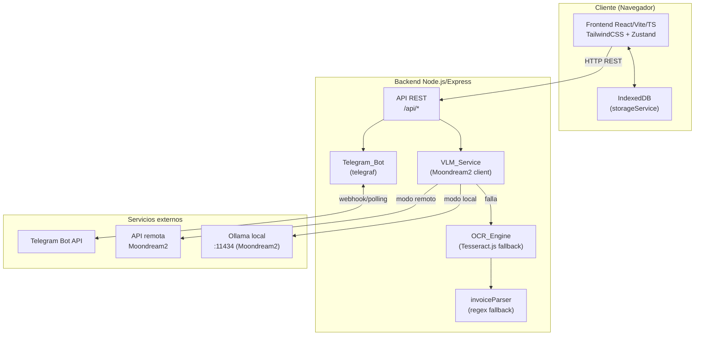
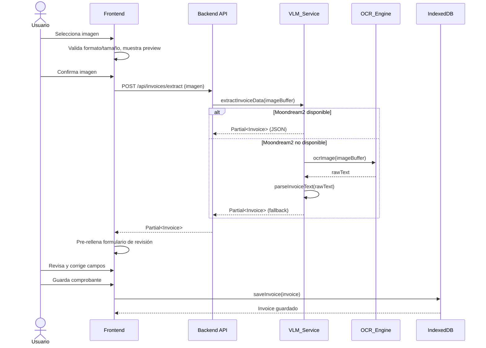
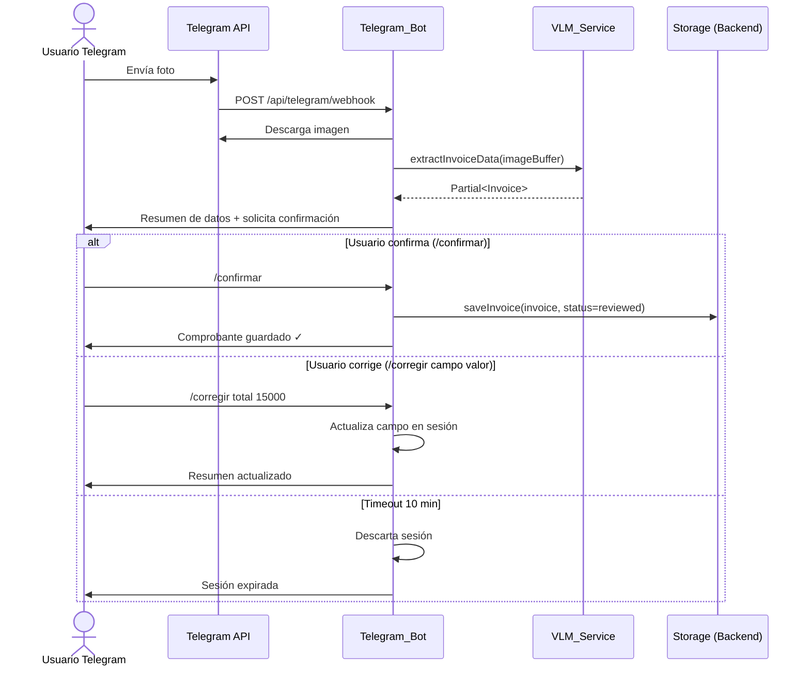
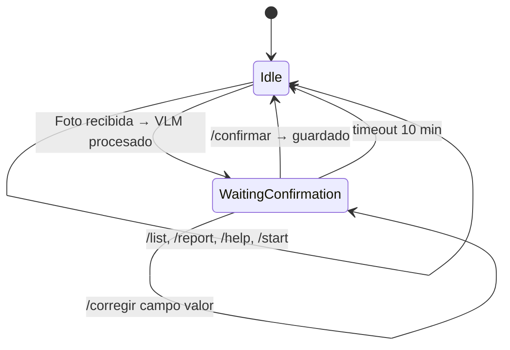

# Documento de Diseño Técnico: invoice-expense-manager

## Overview

El sistema `invoice-expense-manager` es una aplicación full-stack para gestión de facturas y boletas orientada a la declaración de impuestos en Chile. Permite a los usuarios capturar comprobantes tributarios (vía interfaz web o bot de Telegram), extraer sus datos automáticamente mediante el modelo de visión-lenguaje Moondream2, corregirlos manualmente, registrarlos contablemente y generar reportes exportables.

### Objetivos principales

- Reducir la carga de ingreso manual mediante extracción automática de datos con IA (Moondream2).
- Proveer un flujo de revisión y corrección que garantice exactitud contable.
- Ofrecer acceso multiplataforma: interfaz web responsive y bot de Telegram.
- Persistir datos localmente en el navegador (IndexedDB) sin dependencia de base de datos remota.
- Generar reportes y exportaciones útiles para la declaración de impuestos en Chile.

### Decisiones de diseño clave

| Decisión | Alternativa considerada | Razón |
|---|---|---|
| Moondream2 como motor principal de extracción | Solo Tesseract.js | Mayor precisión en documentos estructurados; Tesseract actúa como fallback |
| IndexedDB para persistencia | localStorage | Soporta almacenamiento de imágenes (Blob/base64) y volúmenes mayores |
| Zustand para estado global | Redux / Context API | Menor boilerplate, API simple, compatible con TypeScript |
| Bot de Telegram como canal alternativo | App móvil nativa | Menor costo de desarrollo; los usuarios ya tienen Telegram instalado |
| Backend Node.js/Express | Serverless functions | Necesario para alojar VLM_Service y webhook de Telegram de forma centralizada |

---

## Architecture

El sistema se compone de tres capas principales que se comunican mediante API REST y webhooks:



### Flujo principal: carga de comprobante vía web



### Flujo principal: carga de comprobante vía Telegram



---

## Components and Interfaces

### Estructura de carpetas del proyecto

```
invoice-expense-manager/
├── frontend/                          # Aplicación React
│   ├── src/
│   │   ├── components/
│   │   │   ├── layout/
│   │   │   │   ├── Sidebar.tsx
│   │   │   │   ├── MobileHeader.tsx
│   │   │   │   └── AppLayout.tsx
│   │   │   ├── invoices/
│   │   │   │   ├── InvoiceTable.tsx
│   │   │   │   ├── InvoiceFilters.tsx
│   │   │   │   ├── InvoiceForm.tsx
│   │   │   │   ├── InvoiceCard.tsx
│   │   │   │   └── DuplicateWarning.tsx
│   │   │   ├── dashboard/
│   │   │   │   ├── MetricCard.tsx
│   │   │   │   ├── CategoryPieChart.tsx
│   │   │   │   └── MonthlyBarChart.tsx
│   │   │   ├── reports/
│   │   │   │   ├── MonthlyTable.tsx
│   │   │   │   └── CategoryTable.tsx
│   │   │   └── ui/
│   │   │       ├── Button.tsx
│   │   │       ├── Input.tsx
│   │   │       ├── Select.tsx
│   │   │       ├── Modal.tsx
│   │   │       ├── Badge.tsx
│   │   │       └── ProgressBar.tsx
│   │   ├── pages/
│   │   │   ├── DashboardPage.tsx
│   │   │   ├── UploadInvoicePage.tsx
│   │   │   ├── InvoicesPage.tsx
│   │   │   ├── InvoiceDetailPage.tsx
│   │   │   ├── ReportsPage.tsx
│   │   │   └── SettingsPage.tsx
│   │   ├── services/
│   │   │   ├── apiClient.ts           # Axios/fetch wrapper hacia backend
│   │   │   ├── storageService.ts      # IndexedDB CRUD
│   │   │   └── exportService.ts       # xlsx + CSV
│   │   ├── store/
│   │   │   └── invoiceStore.ts        # Zustand store
│   │   ├── types/
│   │   │   └── invoice.ts
│   │   ├── data/
│   │   │   ├── categories.ts
│   │   │   └── sampleData.ts
│   │   ├── utils/
│   │   │   ├── formatters.ts
│   │   │   ├── calculations.ts
│   │   │   └── rutValidator.ts
│   │   ├── App.tsx
│   │   └── main.tsx
│   ├── index.html
│   ├── vite.config.ts
│   ├── tailwind.config.ts
│   └── package.json
│
├── backend/                           # Servidor Node.js/Express
│   ├── src/
│   │   ├── routes/
│   │   │   ├── invoiceRoutes.ts
│   │   │   ├── vlmRoutes.ts
│   │   │   └── telegramRoutes.ts
│   │   ├── services/
│   │   │   ├── vlmService.ts          # Cliente Moondream2/Ollama
│   │   │   ├── ocrEngine.ts           # Tesseract.js fallback
│   │   │   ├── invoiceParser.ts       # Regex parser fallback
│   │   │   └── telegramBot.ts         # Telegraf bot
│   │   ├── middleware/
│   │   │   ├── upload.ts              # Multer para imágenes
│   │   │   └── errorHandler.ts
│   │   ├── utils/
│   │   │   └── logger.ts
│   │   ├── config.ts
│   │   └── app.ts
│   ├── .env.example
│   └── package.json
│
└── README.md
```

### Componentes React principales

#### `InvoiceForm`
Formulario de revisión/edición de comprobante. Recibe un `Partial<Invoice>` pre-rellenado y emite un `Invoice` completo al guardar.

```typescript
interface InvoiceFormProps {
  initialData: Partial<Invoice>;
  onSave: (invoice: Invoice) => Promise<void>;
  onCancel: () => void;
  imagePreview?: string;
}
```

#### `InvoiceTable`
Tabla paginada con filtros. Recibe la lista de invoices y callbacks de acción.

```typescript
interface InvoiceTableProps {
  invoices: Invoice[];
  onView: (id: string) => void;
  onEdit: (id: string) => void;
  onDelete: (id: string) => void;
  onStatusChange: (id: string, status: InvoiceStatus) => void;
}
```

#### `MetricCard`
Tarjeta de métrica del dashboard.

```typescript
interface MetricCardProps {
  title: string;
  value: string | number;
  subtitle?: string;
  icon?: React.ReactNode;
  trend?: 'up' | 'down' | 'neutral';
}
```

### API REST del Backend

| Método | Endpoint | Descripción |
|--------|----------|-------------|
| `POST` | `/api/invoices/extract` | Recibe imagen, retorna `Partial<Invoice>` |
| `GET` | `/api/vlm/health` | Estado del servidor Moondream2 |
| `POST` | `/api/telegram/webhook` | Webhook de Telegram Bot API |

#### `POST /api/invoices/extract`

**Request:** `multipart/form-data` con campo `image` (JPEG/PNG/WEBP, máx 10 MB).

**Response 200:**
```json
{
  "success": true,
  "data": {
    "providerName": "Cencosud Retail S.A.",
    "providerRut": "76.354.771-9",
    "documentType": "boleta",
    "documentNumber": "123456",
    "date": "2025-06-15",
    "netAmount": 8403,
    "ivaAmount": 1597,
    "totalAmount": 10000,
    "extractionMethod": "moondream2"
  }
}
```

**Response 422 (fallback activado):**
```json
{
  "success": true,
  "data": { "...campos parciales..." },
  "warning": "Moondream2 no disponible. Se usó OCR fallback.",
  "extractionMethod": "ocr_fallback"
}
```

#### `GET /api/vlm/health`

**Response 200:**
```json
{
  "status": "ok",
  "mode": "local",
  "endpoint": "http://localhost:11434",
  "responseTimeMs": 45
}
```

### VLM_Service — Interfaz pública

```typescript
interface VLMService {
  extractInvoiceData(imageBuffer: Buffer): Promise<Partial<Invoice>>;
  checkHealth(): Promise<VLMHealthStatus>;
}

interface VLMHealthStatus {
  available: boolean;
  mode: 'local' | 'remote';
  endpoint: string;
  responseTimeMs?: number;
}
```

El prompt enviado a Moondream2 solicita una respuesta JSON con los campos del comprobante:

```
Analyze this Chilean invoice/receipt image and extract the following fields as JSON:
{
  "providerName": "string",
  "providerRut": "string (format XX.XXX.XXX-X)",
  "documentType": "boleta|factura|otro",
  "documentNumber": "string",
  "date": "YYYY-MM-DD",
  "time": "HH:MM",
  "netAmount": number,
  "ivaAmount": number,
  "exemptAmount": number,
  "otherTaxes": number,
  "totalAmount": number,
  "paymentMethod": "efectivo|débito|crédito|transferencia|otro",
  "items": [{"description": "string", "quantity": number, "unitPrice": number, "total": number}]
}
Return only valid JSON. Use null for fields not found.
```

### Telegram_Bot — Comandos y estados de conversación



| Comando | Descripción |
|---------|-------------|
| `/start` | Mensaje de bienvenida + lista de comandos |
| `/help` | Descripción de todos los comandos |
| `/upload` + foto | Inicia flujo de extracción |
| `/confirmar` | Guarda el comprobante pendiente |
| `/corregir <campo> <valor>` | Corrige un campo del comprobante pendiente |
| `/list [mes año]` | Lista últimos 10 comprobantes (o del mes indicado) |
| `/report [mes año]` | Resumen del mes actual o indicado |

### storageService — Interfaz pública

```typescript
interface StorageService {
  saveInvoice(invoice: Omit<Invoice, 'id' | 'createdAt' | 'updatedAt'>): Promise<Invoice>;
  updateInvoice(id: string, updates: Partial<Invoice>): Promise<Invoice>;
  deleteInvoice(id: string): Promise<void>;
  getAllInvoices(): Promise<Invoice[]>;
  getInvoiceById(id: string): Promise<Invoice | null>;
  initialize(): Promise<void>;
}
```

IndexedDB schema:
- **Database:** `invoice-manager-db` (versión 1)
- **Object store:** `invoices` — keyPath: `id`, índices: `date`, `category`, `status`, `providerName`

### exportService — Interfaz pública

```typescript
interface ExportService {
  exportToExcel(invoices: Invoice[], options?: ExportOptions): Uint8Array;
  exportToCSV(invoices: Invoice[]): string;
  generateMonthlySummary(invoices: Invoice[]): MonthlySummary[];
  generateCategorySummary(invoices: Invoice[]): CategorySummary[];
}

interface ExportOptions {
  includeMonthlySheet?: boolean;
  includeCategorySheet?: boolean;
  dateRange?: { from: Date; to: Date };
}
```

### invoiceStore (Zustand)

```typescript
interface InvoiceStore {
  invoices: Invoice[];
  filters: InvoiceFilters;
  isLoading: boolean;
  
  // Actions
  loadInvoices(): Promise<void>;
  addInvoice(invoice: Omit<Invoice, 'id' | 'createdAt' | 'updatedAt'>): Promise<void>;
  updateInvoice(id: string, updates: Partial<Invoice>): Promise<void>;
  deleteInvoice(id: string): Promise<void>;
  setFilters(filters: Partial<InvoiceFilters>): void;
  getFilteredInvoices(): Invoice[];
}
```

---

## Data Models

### Tipos TypeScript principales

```typescript
// types/invoice.ts

export type DocumentType = 'boleta' | 'factura' | 'boleta_electronica' | 'factura_electronica' | 'otro';
export type PaymentMethod = 'efectivo' | 'débito' | 'crédito' | 'transferencia' | 'otro';
export type InvoiceStatus = 'pending' | 'reviewed' | 'approved';

export interface InvoiceItem {
  id: string;
  description: string;
  quantity: number;
  unitPrice: number;
  total: number;
}

export interface Invoice {
  id: string;                        // UUID v4
  providerName: string;
  providerRut: string;               // Formato XX.XXX.XXX-X
  documentType: DocumentType;
  documentNumber: string;
  date: string;                      // ISO 8601: YYYY-MM-DD
  time?: string;                     // HH:MM
  category: InvoiceCategory;
  items: InvoiceItem[];
  netAmount: number;                 // Monto neto (sin IVA)
  ivaAmount: number;                 // IVA (19%)
  exemptAmount: number;              // Monto exento
  otherTaxes: number;                // Otros impuestos
  totalAmount: number;               // Total del comprobante
  paymentMethod: PaymentMethod;
  imageUrl?: string;                 // base64 o URL blob
  rawOcrText?: string;               // Texto OCR original
  status: InvoiceStatus;
  notes?: string;
  createdAt: string;                 // ISO 8601
  updatedAt: string;                 // ISO 8601
}

export type InvoiceCategory =
  | 'Supermercado'
  | 'Combustible'
  | 'Transporte'
  | 'Servicios básicos'
  | 'Arriendo'
  | 'Comida'
  | 'Insumos de trabajo'
  | 'Equipamiento'
  | 'Marketing'
  | 'Internet/Telefonía'
  | 'Otros';

export interface InvoiceFilters {
  month?: number;                    // 1-12
  year?: number;
  category?: InvoiceCategory;
  providerSearch?: string;           // Búsqueda parcial
  status?: InvoiceStatus;
}

export interface MonthlySummary {
  year: number;
  month: number;
  count: number;
  netAmount: number;
  ivaAmount: number;
  exemptAmount: number;
  otherTaxes: number;
  totalAmount: number;
}

export interface CategorySummary {
  category: InvoiceCategory;
  count: number;
  netAmount: number;
  ivaAmount: number;
  totalAmount: number;
}

export interface DashboardMetrics {
  currentMonth: {
    totalAmount: number;
    ivaAmount: number;
    netAmount: number;
    count: number;
  };
  last12Months: MonthlySummary[];
  byCategory: CategorySummary[];
  recentInvoices: Invoice[];
}
```

### Variables de entorno del backend

```bash
# .env.example

# VLM Service
VLM_MODE=local                          # local | remote
VLM_LOCAL_URL=http://localhost:11434    # Ollama endpoint
VLM_REMOTE_URL=                         # URL API remota (si VLM_MODE=remote)
VLM_TIMEOUT_MS=30000                    # Timeout por solicitud

# Telegram Bot
TELEGRAM_BOT_TOKEN=                     # Token del bot
TELEGRAM_WEBHOOK_URL=                   # URL pública para webhook
TELEGRAM_ALLOWED_USER_IDS=             # IDs separados por coma

# Server
PORT=3001
NODE_ENV=development
```

---

## Correctness Properties

*Una propiedad es una característica o comportamiento que debe mantenerse verdadero en todas las ejecuciones válidas del sistema — esencialmente, una declaración formal sobre lo que el sistema debe hacer. Las propiedades sirven como puente entre las especificaciones legibles por humanos y las garantías de corrección verificables por máquinas.*

---

### Property 1: Validación de formato de imagen

*Para cualquier* archivo de entrada, la función de validación de imagen debe aceptar exactamente los formatos JPEG, PNG y WEBP con tamaño ≤ 10 MB, y rechazar cualquier otro formato o tamaño mayor.

**Validates: Requirements 1.1, 1.3**

---

### Property 2: Detección de duplicados

*Para cualquier* lista de comprobantes existentes y cualquier comprobante nuevo que comparta los mismos valores de `providerName`, `documentNumber` y `totalAmount` con alguno de la lista, la función de detección de duplicados debe retornar `true`.

**Validates: Requirements 1.5**

---

### Property 3: Robustez de extractInvoiceData

*Para cualquier* `Buffer` de entrada (válido, vacío o corrupto), la función `extractInvoiceData` debe resolver la promesa (nunca rechazarla con una excepción no controlada) y retornar un `Partial<Invoice>`.

**Validates: Requirements 2.7**

---

### Property 4: Consistencia de extractInvoiceData

*Para cualquier* imagen de comprobante válida, llamar a `extractInvoiceData` dos veces sobre el mismo buffer debe producir resultados con los mismos campos numéricos (`netAmount`, `ivaAmount`, `totalAmount`).

**Validates: Requirements 2.8**

---

### Property 5: Activación del fallback ante error del VLM

*Para cualquier* tipo de error del VLM_Service (timeout, error de red, JSON inválido), el sistema debe activar el OCR fallback y retornar un `Partial<Invoice>` sin lanzar excepciones al caller.

**Validates: Requirements 2.5, 13.5, 13.6**

---

### Property 6: Extracción de campos del parser

*Para cualquier* texto que contenga RUTs chilenos (con o sin puntos), fechas en formatos `DD/MM/YYYY`, `DD-MM-YYYY` o `DD/MM/YY`, montos precedidos por palabras clave (`TOTAL`, `NETO`, `IVA`, `EXENTO`, `SUBTOTAL`), números de documento precedidos por (`BOLETA`, `FACTURA`, `N°`, `NRO`, `FOLIO`) o métodos de pago (`EFECTIVO`, `DÉBITO`, `CRÉDITO`, `TRANSFERENCIA`), la función `parseInvoiceText` debe extraer correctamente el campo correspondiente en el `Partial<Invoice>` retornado.

**Validates: Requirements 3.1, 3.2, 3.3, 3.4, 3.5**

---

### Property 7: Extracción de ítems del parser

*Para cualquier* texto que contenga líneas con el patrón `descripción cantidad precio_unitario total`, la función `parseInvoiceText` debe retornar un arreglo `items` con al menos un `InvoiceItem` por cada línea que cumpla el patrón, con los valores numéricos correctos.

**Validates: Requirements 3.6**

---

### Property 8: Robustez del parser

*Para cualquier* string de entrada (incluyendo cadena vacía, caracteres especiales, texto no relacionado con facturas), la función `parseInvoiceText` debe retornar un objeto `Partial<Invoice>` sin lanzar excepciones.

**Validates: Requirements 3.7**

---

### Property 9: Idempotencia del parser

*Para cualquier* string de entrada, ejecutar `parseInvoiceText` dos veces sobre el mismo texto debe producir resultados con los mismos valores en todos los campos.

**Validates: Requirements 3.8**

---

### Property 10: Validación del dígito verificador del RUT

*Para cualquier* RUT chileno con dígito verificador correcto (calculado con el algoritmo módulo 11), la función `rutValidator` debe retornar `true`. Para cualquier RUT con dígito verificador incorrecto, debe retornar `false`.

**Validates: Requirements 4.3**

---

### Property 11: Cálculo de total en tiempo real

*Para cualquier* combinación de valores (`netAmount`, `ivaAmount`, `exemptAmount`, `otherTaxes`) ≥ 0, el total calculado por la función de cálculo debe ser igual a `netAmount + ivaAmount + exemptAmount + otherTaxes`.

**Validates: Requirements 4.4**

---

### Property 12: Advertencia de inconsistencia de montos

*Para cualquier* `Invoice` donde `|totalAmount - (netAmount + ivaAmount + exemptAmount + otherTaxes)| > 1`, la función de validación de consistencia debe retornar una advertencia (no un error bloqueante).

**Validates: Requirements 4.5**

---

### Property 13: Validación de campos requeridos

*Para cualquier* objeto `Invoice` con al menos uno de los campos `date`, `category` o `totalAmount` ausente o vacío, la función de validación debe retornar `false` e impedir el guardado.

**Validates: Requirements 4.6**

---

### Property 14: Asignación de estado al guardar

*Para cualquier* comprobante guardado sin modificaciones manuales, el campo `status` debe ser `'pending'`. Para cualquier comprobante donde el usuario haya editado al menos un campo, el campo `status` debe ser `'reviewed'`.

**Validates: Requirements 4.7**

---

### Property 15: Corrección del filtrado de comprobantes

*Para cualquier* lista de comprobantes y cualquier combinación de filtros (`month`, `year`, `category`, `providerSearch`, `status`), todos los comprobantes retornados por la función de filtrado deben cumplir simultáneamente todos los criterios del filtro aplicado.

**Validates: Requirements 5.2**

---

### Property 16: Round-trip de eliminación en storage

*Para cualquier* `Invoice` guardado con `saveInvoice`, después de llamar a `deleteInvoice(id)`, la llamada a `getInvoiceById(id)` debe retornar `null`.

**Validates: Requirements 5.6**

---

### Property 17: Actualización de `updatedAt`

*Para cualquier* `Invoice` existente, después de llamar a `updateInvoice(id, updates)`, el campo `updatedAt` del invoice retornado debe ser mayor o igual al `updatedAt` anterior.

**Validates: Requirements 5.8**

---

### Property 18: Round-trip de persistencia en IndexedDB

*Para cualquier* `Invoice` válido guardado con `saveInvoice`, llamar a `getInvoiceById` con el `id` retornado debe producir un objeto con los mismos valores en todos los campos.

**Validates: Requirements 10.3, 10.6**

---

### Property 19: Pureza del exportService

*Para cualquier* arreglo de `Invoice`, llamar a `exportToCSV` dos veces sobre el mismo arreglo debe producir exactamente el mismo string de salida.

**Validates: Requirements 9.6**

---

### Property 20: Round-trip de exportación a Excel

*Para cualquier* arreglo de `Invoice` válidos, exportar a Excel con `exportToExcel` y luego parsear el archivo resultante debe producir los mismos valores numéricos originales (`netAmount`, `ivaAmount`, `exemptAmount`, `otherTaxes`, `totalAmount`) para cada comprobante.

**Validates: Requirements 9.7**

---

## Error Handling

### Estrategia general

El sistema adopta una estrategia de **degradación elegante**: ante cualquier fallo en un servicio externo o módulo interno, el sistema debe continuar funcionando con capacidades reducidas en lugar de fallar completamente.

### Jerarquía de errores del backend

```typescript
// Errores del VLM_Service
class VLMServiceError extends Error {
  constructor(message: string, public readonly cause?: Error) { super(message); }
}
class VLMTimeoutError extends VLMServiceError {}
class VLMInvalidResponseError extends VLMServiceError {}

// Errores del OCR Engine
class OCREngineError extends Error {}

// Errores del Storage
class StorageError extends Error {
  constructor(message: string, public readonly operation: string) { super(message); }
}

// Errores del Telegram Bot
class TelegramBotError extends Error {}
class UnauthorizedUserError extends TelegramBotError {}
```

### Manejo de errores por módulo

| Módulo | Tipo de error | Comportamiento |
|--------|--------------|----------------|
| VLM_Service | Timeout (>30s) | Activa fallback OCR; registra en log |
| VLM_Service | JSON inválido | Intenta extracción por regex; si falla, activa fallback OCR |
| VLM_Service | Error de red | Activa fallback OCR inmediatamente |
| OCR_Engine | Fallo de Tesseract | Retorna formulario vacío con mensaje de error |
| Storage (IndexedDB) | Error de escritura | Retorna `StorageError` descriptivo; no lanza excepción |
| Storage (IndexedDB) | Error de lectura | Retorna array vacío o `null` según la operación |
| Export_Service | Array vacío | Retorna archivo Excel/CSV vacío con encabezados |
| Telegram_Bot | Usuario no autorizado | Responde con mensaje de acceso denegado; no procesa |
| Telegram_Bot | Timeout de sesión (10 min) | Descarta datos de sesión; notifica al usuario |
| API REST | Imagen inválida (formato/tamaño) | HTTP 400 con mensaje descriptivo |
| API REST | Error interno | HTTP 500 con mensaje genérico; detalle en log |

### Logging del backend

Cada solicitud al VLM_Service se registra con:
```json
{
  "timestamp": "2025-06-15T10:30:00.000Z",
  "imageSize": 245678,
  "responseTimeMs": 1250,
  "extractionMethod": "moondream2 | ocr_fallback | manual",
  "success": true,
  "error": null
}
```

### Manejo de errores en el frontend

- Los errores de red hacia el backend se capturan en `apiClient.ts` y se propagan al store de Zustand.
- El store expone un campo `error: string | null` que los componentes consumen para mostrar notificaciones.
- Los errores de IndexedDB se muestran como toasts no bloqueantes.
- Los errores de validación de formulario se muestran inline junto al campo correspondiente.

---

## Testing Strategy

### Enfoque dual: tests unitarios + tests basados en propiedades

La estrategia de testing combina dos enfoques complementarios:

1. **Tests de ejemplo (unitarios)**: verifican comportamientos específicos con entradas concretas, casos de borde y condiciones de error.
2. **Tests basados en propiedades (PBT)**: verifican propiedades universales sobre rangos amplios de entradas generadas aleatoriamente.

### Biblioteca de PBT seleccionada

**[fast-check](https://github.com/dubzzz/fast-check)** para TypeScript/JavaScript.

- Mínimo **100 iteraciones** por test de propiedad.
- Cada test de propiedad debe referenciar la propiedad del documento de diseño con el tag:
  `// Feature: invoice-expense-manager, Property N: <texto de la propiedad>`

### Tests unitarios (ejemplos y casos de borde)

| Módulo | Tests de ejemplo |
|--------|-----------------|
| `rutValidator` | RUT válido conocido, RUT con dígito K, RUT sin puntos, RUT con formato incorrecto |
| `invoiceParser` | Boleta Cencosud, factura electrónica, texto vacío, texto sin campos reconocibles |
| `calculations` | Total = 0, valores negativos (deben rechazarse), overflow de enteros |
| `storageService` | Inicialización con DB vacía, operaciones CRUD secuenciales |
| `exportService` | Array vacío, un invoice, 1000 invoices |
| `VLM_Service` | Mock de Moondream2 disponible, mock de timeout, mock de JSON inválido |
| `Telegram_Bot` | Comando /start, foto válida, usuario no autorizado, timeout de sesión |

### Tests basados en propiedades (PBT)

Cada propiedad del documento se implementa como un test de fast-check:

```typescript
// Ejemplo: Property 9 - Idempotencia del parser
import fc from 'fast-check';
import { parseInvoiceText } from '../services/invoiceParser';

// Feature: invoice-expense-manager, Property 9: Idempotencia del parser
test('parseInvoiceText es idempotente', () => {
  fc.assert(
    fc.property(fc.string(), (text) => {
      const result1 = parseInvoiceText(text);
      const result2 = parseInvoiceText(text);
      expect(result1).toEqual(result2);
    }),
    { numRuns: 100 }
  );
});
```

```typescript
// Ejemplo: Property 11 - Cálculo de total
// Feature: invoice-expense-manager, Property 11: Cálculo de total en tiempo real
test('calculateTotal suma correctamente los componentes', () => {
  fc.assert(
    fc.property(
      fc.nat(), fc.nat(), fc.nat(), fc.nat(),
      (net, iva, exempt, other) => {
        const total = calculateTotal(net, iva, exempt, other);
        expect(total).toBe(net + iva + exempt + other);
      }
    ),
    { numRuns: 100 }
  );
});
```

```typescript
// Ejemplo: Property 18 - Round-trip de persistencia
// Feature: invoice-expense-manager, Property 18: Round-trip de persistencia en IndexedDB
test('saveInvoice + getInvoiceById preserva todos los campos', () => {
  fc.assert(
    fc.asyncProperty(arbitraryInvoice(), async (invoice) => {
      const saved = await storageService.saveInvoice(invoice);
      const retrieved = await storageService.getInvoiceById(saved.id);
      expect(retrieved).toMatchObject(invoice);
    }),
    { numRuns: 100 }
  );
});
```

### Mapa de propiedades a tests

| Propiedad | Módulo bajo test | Tipo de generador fast-check |
|-----------|-----------------|------------------------------|
| 1 | `validateImageFile` | `fc.uint8Array()`, `fc.constantFrom('image/jpeg', 'application/pdf', ...)` |
| 2 | `detectDuplicate` | `fc.array(arbitraryInvoice())`, `arbitraryInvoice()` |
| 3 | `vlmService.extractInvoiceData` | `fc.uint8Array()` (con mock de Moondream2) |
| 4 | `vlmService.extractInvoiceData` | `fc.uint8Array()` de imágenes válidas (con mock) |
| 5 | `vlmService.extractInvoiceData` | `fc.constantFrom(timeoutError, networkError, invalidJsonError)` |
| 6 | `parseInvoiceText` | `fc.string()` con patrones de RUT, fecha, monto |
| 7 | `parseInvoiceText` | `fc.array(arbitraryInvoiceItemLine())` |
| 8 | `parseInvoiceText` | `fc.string()` (cualquier string) |
| 9 | `parseInvoiceText` | `fc.string()` |
| 10 | `rutValidator` | `fc.integer({ min: 1000000, max: 99999999 })` + cálculo de DV |
| 11 | `calculateTotal` | `fc.nat()` × 4 |
| 12 | `validateAmountConsistency` | `fc.record({ netAmount: fc.nat(), ... })` con diferencia > 1 |
| 13 | `validateRequiredFields` | `arbitraryInvoice()` con campos faltantes |
| 14 | `assignStatus` | `fc.boolean()` (wasModified) |
| 15 | `filterInvoices` | `fc.array(arbitraryInvoice())`, `arbitraryFilters()` |
| 16 | `storageService` | `arbitraryInvoice()` |
| 17 | `storageService.updateInvoice` | `arbitraryInvoice()`, `arbitraryUpdates()` |
| 18 | `storageService` | `arbitraryInvoice()` |
| 19 | `exportService.exportToCSV` | `fc.array(arbitraryInvoice())` |
| 20 | `exportService.exportToExcel` | `fc.array(arbitraryInvoice())` |

### Tests de integración

| Escenario | Descripción |
|-----------|-------------|
| VLM_Service ↔ Ollama | Verificar que el endpoint `/api/invoices/extract` llama a Ollama con el prompt correcto (1-2 ejemplos con mock HTTP) |
| Telegram webhook | Verificar que el endpoint `/api/telegram/webhook` procesa una actualización de foto correctamente (1-2 ejemplos) |
| Flujo completo web | Upload → extracción → guardado en IndexedDB → aparece en lista (test E2E con Playwright) |

### Tests de humo (smoke tests)

| Verificación | Descripción |
|-------------|-------------|
| VLM health check | `GET /api/vlm/health` retorna 200 con modo configurado |
| Backend startup | El servidor inicia sin errores con variables de entorno válidas |
| IndexedDB init | La base de datos se inicializa correctamente en el primer inicio |

### Herramientas de testing

| Herramienta | Uso |
|-------------|-----|
| **Vitest** | Test runner para frontend y backend |
| **fast-check** | Property-based testing |
| **@testing-library/react** | Tests de componentes React |
| **Playwright** | Tests E2E |
| **Supertest** | Tests de API REST |
| **msw** (Mock Service Worker) | Mock de llamadas HTTP en frontend |
